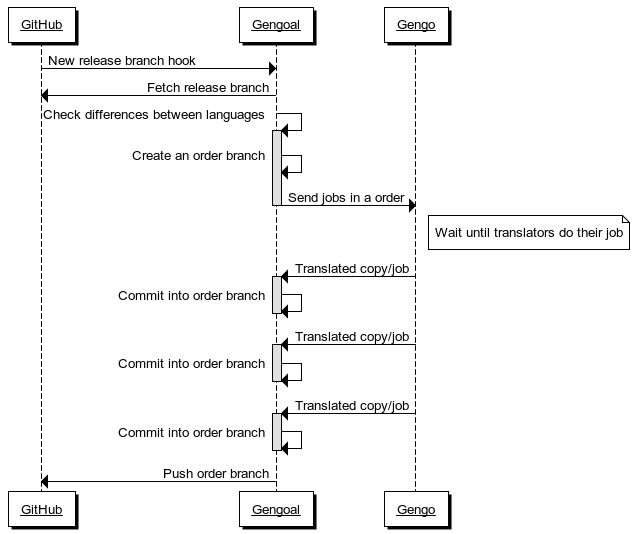

# Gengoal

  Tool to translate and track your project copies with the [Gengo API](http://www.gengo.com).
  

## Installation

    $ npm install gengoal
    
## How does it work?

Steps:

- A new release branch is pushed to GitHub
- A GitHub hook hits the Gengoal instance
- Gengoal fetches the new branch to a local directory
- Gengoal check the differences between the master configured language and the other available languages
- It pushes a Gengo order with all the differences to be translated
- It starts to get all the translated copies
- When all the copies are translated it pushes a branch to GitHub
- It creates a pull request to be reviewed by the development team


    
## Setup

- Configure your repositories
- Setup the Gengoal and GitHub environment variables
- Start the a Gengoal instance with internet access
- Add a webhook configuration to your GitHub repository


### Configure your repositories

```

{
    "port": 5000,

    "comment": "Please don't ...",

    "repositories": [
      {
        "url": "git@github.com:your/repository.git"
      , "name": "app-frontend"
      , "directory": "app/translations"
      , "master": "en"
      , "only": "es.*" # Translate only keys that match this RegExp
      , "tier": "standard"
      , "master": "en"
      , "comment": "Please don't..."
      , "branch": "release/.*"
      }
    ]
}

```

### Setup the environment variables

To be able to connect all the tool parts, you need to setup the environment variables below:

- `GENGOAL_CALLBACK`: The public url pointing to the Gengoal instance. Ex: `http://mydomain.com/gengoal/`. To test the tool you can play with [localtunnel](https://localtunnel.me) or [ngork](https://ngrok.com)
- `GENGOAL_PUBLIC_KEY`: Your Gengo public key
- `GENGOAL_PRIVATE_KEY`: Your Gengo private key
- `GENGOAL_GITHUB_USERNAME`: Your commiter GitHub user to create pull requests
- `GENGOAL_GITHUB_BASIC_PASSWORD`: Your commiter GitHub user password

### Start the a Gengoal instance

```
> gengoal
```

An this is a common output:

```
Initialized Gengo connection!
Spent: -274.94 USD
Fetching glossaries...
Initializing repositories...
Fetching git@github.com:fcsonline/my-project.git...
Rebased!
Loading languages for "my-project" repository...
Normalizating languages for "my-project" repository...
Commited!
Files normalized
Repositories initialized...
Gengo Tracker Server: Listening on port 5000

Incoming branch "feature/test-gengoal" for respository "my-project"...
Rebased!
Checkout!
Checking differences between "de" and "en"...
Checking differences between "es" and "en"...
Checking differences between "fr" and "en"...
Checking differences between "it" and "en"...
Checking differences between "zh" and "en"...
Sending 2 jobs for the repository "my-project" to Gengo...
Processing new order 319578 with 2 jobs (1.15 USD) in Gengo...
Branched!
Created a new branch "gengo-319578" for order 319578
Incoming job for respository "my-project" with status "available"...
Incoming job for respository "my-project" with status "available"...
Incoming job for respository "my-project" with status "approved"...
Checkout!
Commited!
Added a new copy to the order branch "gengo-319578"
Incoming job for respository "my-project" with status "approved"...
Checkout!
Commited!
Added a new copy to the order branch "gengo-319578"
The order "gengo-319578" is completed. Pushing the branch...
Pushed!
Creating the pullrequest...
Pull Request created! :D
```

    
## Links

 - [Gengo](https://www.gengo.com/)
 - [Gengo API](https://developers.gengo.com/)

## License

(The MIT License)

Copyright (c) 2014 fcsonline &lt;fcsonline@gmail.com&gt;

Permission is hereby granted, free of charge, to any person obtaining
a copy of this software and associated documentation files (the
'Software'), to deal in the Software without restriction, including
without limitation the rights to use, copy, modify, merge, publish,
distribute, sublicense, and/or sell copies of the Software, and to
permit persons to whom the Software is furnished to do so, subject to
the following conditions:

The above copyright notice and this permission notice shall be
included in all copies or substantial portions of the Software.

THE SOFTWARE IS PROVIDED 'AS IS', WITHOUT WARRANTY OF ANY KIND,
EXPRESS OR IMPLIED, INCLUDING BUT NOT LIMITED TO THE WARRANTIES OF
MERCHANTABILITY, FITNESS FOR A PARTICULAR PURPOSE AND NONINFRINGEMENT.
IN NO EVENT SHALL THE AUTHORS OR COPYRIGHT HOLDERS BE LIABLE FOR ANY
CLAIM, DAMAGES OR OTHER LIABILITY, WHETHER IN AN ACTION OF CONTRACT,
TORT OR OTHERWISE, ARISING FROM, OUT OF OR IN CONNECTION WITH THE
SOFTWARE OR THE USE OR OTHER DEALINGS IN THE SOFTWARE.
